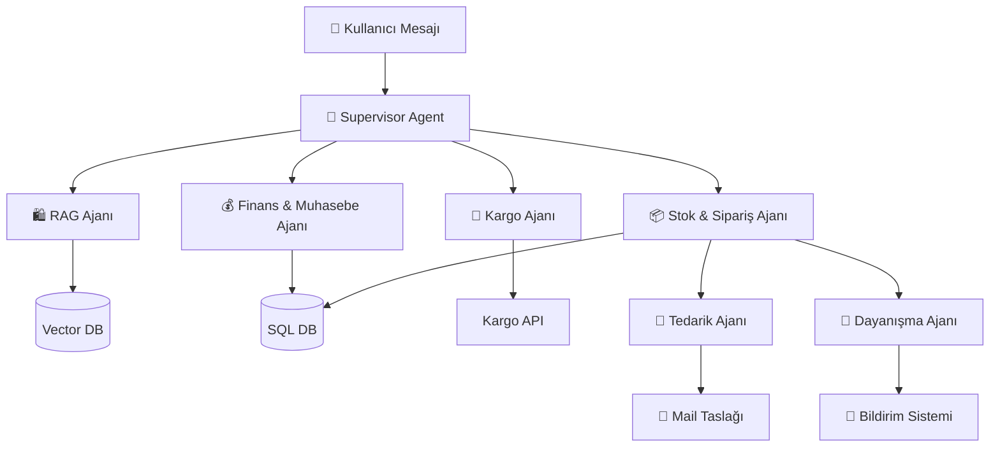
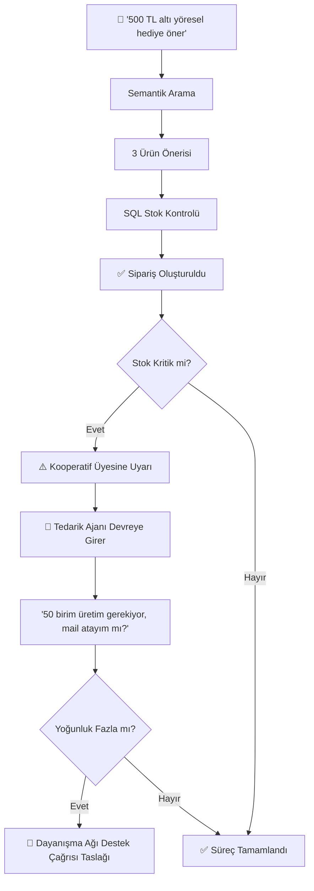

# 🌿 KoopgeLLM
### AI Destekli Kadın Kooperatifi Operasyon Asistanı

> *Satıştan stoka, müşteriden dayanışmaya — yapay zekâ destekli dijital yol arkadaşı.*


## Nedir?

KoopgeLLM, kadın kooperatiflerinin web sitesine entegre çalışan **çok ajanlı AI operasyon sistemidir.** Sıradan bir chatbot değil — sipariş alır, stok yönetir, muhasebe özetler, kargo takip eder, tedarik önerir ve yoğun dönemlerde yerel kadın dayanışma ağı için destek çağrısı hazırlar.

## Neden?

| Gerçek Problem | Bugünkü Durum |
|---|---|
| Siparişler her kanaldan geliyor | WhatsApp, Instagram, telefon, fiziksel |
| Stok takibi | Defter veya Excel |
| Müşteri soruları | Manuel, yavaş, yorucu |
| Finansal görünürlük | Yok denecek kadar az |
| Yoğun dönemde iş gücü | Koordine edilemiyor |

## Nasıl Çalışır?



## Demo Senaryosu



## Ajanlar

| Ajan | Görev |
|---|---|
| 🧠 Supervisor | Mesajı analiz et, doğru ajana yönlendir |
| 🛍️ RAG Ajanı | Semantik ürün arama ve öneri |
| 📦 Stok & Sipariş | SQL'den kesin stok, sipariş oluşturma, uyarı |
| 💰 Finans | Günlük ciro, en çok satan, yaklaşan ödemeler |
| 🚚 Kargo | Sipariş durumu, müşteri bilgilendirme |
| 🔮 Tedarik | Satış hızına göre üretim önerisi, mail taslağı |
| 🤝 Dayanışma | Kapasite analizi, güvenli istihdam ağı çağrısı |


## Teknik Yığın

```
Backend   →  Python · FastAPI · LangGraph
AI Model  →  OpenAI API
Vector DB →  ChromaDB  (semantik arama)
SQL DB    →  PostgreSQL / SQLite  (kesin veriler)
Frontend  →  React / Next.js
Deploy    →  Render · Vercel · Docker
```

**Önemli teknik seçimler:**
- **SQL + Vector ayrımı:** Stok/sipariş kesin SQL'de, ürün anlamı vector'da
- **State management:** Çok adımlı konuşmalarda bağlam kaybolmaz
- **Tool calling:** Ajanlar SQL sorgusu, mail taslağı, kargo API'yi kontrollü çağırır

## Sosyal Etki

KoopgeLLM, kadın kooperatiflerinin **ekonomik dayanıklılığını** ve **yerel kadın dayanışmasını** güçlendirmeyi hedefler. Yoğun dönemlerde üretim açığını analiz eder; belediye kadın destek birimleri, kadın dayanışma merkezleri ve güvenli yerel istihdam ağları için etik bir destek çağrısı metni oluşturur.

AI burada yalnızca otomasyon değil — **kadın emeği ve dayanışma için somut bir köprüdür.**

## Gelecek

`WhatsApp entegrasyonu` · `Gerçek kargo API` · `SMS/e-posta kampanya ajanı` · `Sesli asistan` · `Mobil uygulama` · `Çoklu kooperatif paneli`

<div align="center">
<b>🌿 KoopgeLLM — Kadın emeğine, üretimine ve dayanışmasına yapay zekâ desteği.</b>
</div>
